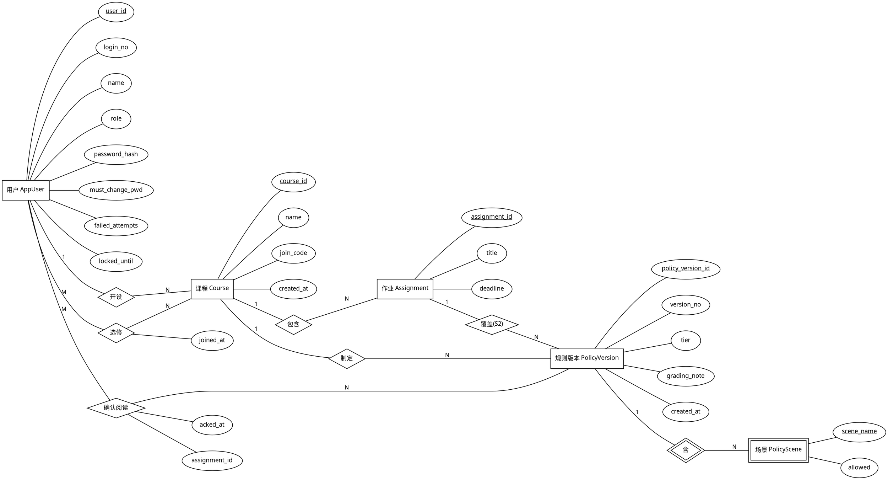
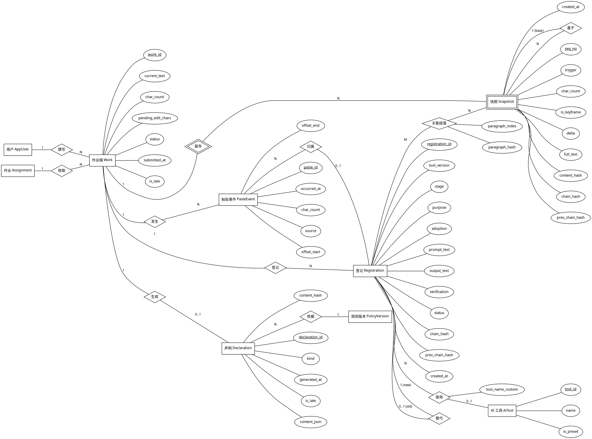
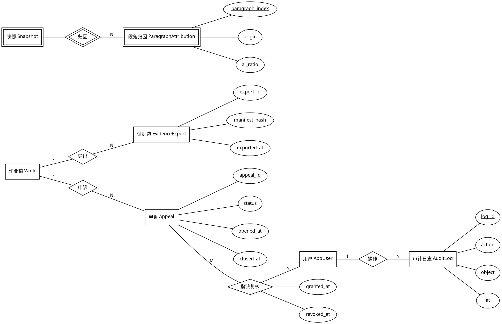

# ER 图（Chen 氏，手绘录入版）

> 杨子航手绘，2026-09-14 晚，三页，照片 `ER图-手绘-第1页.jpg`（账号与规则）、`第2页.jpg`（作业与留痕）、`第3页.jpg`（Sprint 2 部分与枚举）。录入：张家森。
> Chen 氏记法：实体 = 矩形，弱实体 = 双框矩形，属性 = 椭圆，键属性 = 下划线，多值属性 = 双框椭圆，联系 = 菱形，标识联系 = 双框菱形，基数写在连线上。
> 录入用 Graphviz DOT，`dot -Tpng ER图.dot -o ER图.png` 可渲染；机房没装 Graphviz 时直接看下面的实体表和联系表，内容一致。

## 第 1 页：账号与规则

## 第 2 页：作业与留痕

## 第 3 页：Sprint 2 部分（画了轮廓，属性只写键）

## 实体表（与图一致）

| 实体                           | 键                             | 主要属性                                                                                                                        | 来源卡                |
| ------------------------------ | ------------------------------ | ------------------------------------------------------------------------------------------------------------------------------- | --------------------- |
| AppUser                        | user_id                        | login_no（学号或工号）、name、role、password_hash、must_change_pwd、failed_attempts、locked_until                               | ACC-04、PERM-01       |
| Course                         | course_id                      | name、join_code（6 位）、created_at                                                                                             | ACC-01、ACC-02        |
| Assignment                     | assignment_id                  | title、deadline                                                                                                                 | ACC-01                |
| PolicyVersion                  | policy_version_id              | version_no、tier、grading_note、created_at                                                                                      | RULE-01、RULE-03、K-2 |
| PolicyScene（弱）              | policy_version_id + scene_name | allowed                                                                                                                         | RULE-01               |
| Work                           | work_id                        | current_text、char_count、pending_edit_chars、status、submitted_at、is_late                                                     | WRK-01、DECL-01       |
| Snapshot（弱）                 | work_id + seq_no               | trigger、char_count、is_keyframe、delta、full_text、content_hash、chain_hash、prev_chain_hash、created_at                       | WRK-02、EVD-01        |
| PasteEvent                     | paste_id                       | occurred_at、char_count、source、offset_start、offset_end                                                                       | WRK-03                |
| Registration                   | registration_id                | tool_version、stage、purpose、adoption、prompt_text、output_text、verification、status、chain_hash、prev_chain_hash、created_at | REG-01、REG-02        |
| AiTool                         | tool_id                        | name、is_preset                                                                                                                 | REG-01                |
| Declaration                    | declaration_id                 | kind、generated_at、is_late、content_json、content_hash                                                                         | DECL-01、DECL-02      |
| ParagraphAttribution（弱，S2） | snapshot_id + paragraph_index  | origin、ai_ratio                                                                                                                | TCH-04                |
| EvidenceExport（S2）           | export_id                      | manifest_hash、exported_at                                                                                                      | EVD-02                |
| Appeal（S2）                   | appeal_id                      | status、opened_at、closed_at                                                                                                    | APL-01                |
| AuditLog（S2）                 | log_id                         | action、object、at                                                                                                              | PERM-02               |

## 联系表

| 联系           | 参与实体                       | 基数     | 联系属性                        | 说明                                     |
| -------------- | ------------------------------ | -------- | ------------------------------- | ---------------------------------------- |
| 开设           | AppUser（教师）、Course        | 1 : N    |                                 |                                          |
| 选修           | AppUser（学生）、Course        | M : N    | joined_at                       | 落成 enrollment 表                       |
| 包含           | Course、Assignment             | 1 : N    |                                 |                                          |
| 制定           | Course、PolicyVersion          | 1 : N    |                                 | 每改一次多一行，不更新旧行               |
| 覆盖（S2）     | Assignment、PolicyVersion      | 1 : N    |                                 | 作业级规则                               |
| 含（标识）     | PolicyVersion、PolicyScene     | 1 : N    |                                 | 弱实体                                   |
| 确认阅读       | AppUser（学生）、PolicyVersion | M : N    | acked_at、assignment_id         | 落成 policy_ack 表，规则改版后要重新确认 |
| 撰写           | AppUser（学生）、Work          | 1 : N    |                                 | 与"收取"合起来：一人一作业一稿           |
| 收取           | Assignment、Work               | 1 : N    |                                 |                                          |
| 留存（标识）   | Work、Snapshot                 | 1 : N    |                                 | 弱实体，seq_no 从 1 递增                 |
| 基于           | Snapshot、Snapshot             | 1 : N    |                                 | 差分基于哪个快照，关键帧无 base          |
| 发生           | Work、PasteEvent               | 1 : N    |                                 |                                          |
| 归属           | PasteEvent、Registration       | N : 0..1 |                                 | 选了 AI 来源的粘贴对应一条登记           |
| 登记           | Work、Registration             | 1 : N    |                                 |                                          |
| 使用           | Registration、AiTool           | N : 0..1 | tool_name_custom                | 不在预置清单时用自定义名                 |
| 替代           | Registration、Registration     | 1 : 0..1 |                                 | 新记录指向被作废的旧记录                 |
| 关联段落       | Registration、Snapshot         | M : N    | paragraph_index、paragraph_hash | 落成 registration_paragraph 表           |
| 生成           | Work、Declaration              | 1 : 0..1 |                                 | 提交后才有                               |
| 依据           | Declaration、PolicyVersion     | N : 1    |                                 | 提交时生效的规则版本                     |
| 归因（S2）     | Snapshot、ParagraphAttribution | 1 : N    |                                 | 弱实体                                   |
| 导出（S2）     | Work、EvidenceExport           | 1 : N    |                                 |                                          |
| 申诉（S2）     | Work、Appeal                   | 1 : N    |                                 |                                          |
| 指派复核（S2） | Appeal、AppUser（复核员）      | M : N    | granted_at、revoked_at          | 落成 appeal_reviewer 表                  |
| 操作（S2）     | AppUser、AuditLog              | 1 : N    |                                 |                                          |

## 枚举值（两张图共用，杨子航写在第 3 页下方）

| 枚举          | 值                                                                                                         | 对应验收           |
| ------------- | ---------------------------------------------------------------------------------------------------------- | ------------------ |
| role          | STUDENT、TEACHER、REVIEWER、AFFAIRS、ADMIN                                                                 | PERM-01            |
| tier          | FORBID（禁止）、DECLARE（需声明）、ENCOURAGE（鼓励）                                                       | RULE-01            |
| work.status   | DRAFT、SUBMITTED                                                                                           | DECL-01-3          |
| trigger       | TIME、EDIT_VOLUME、IMPORT、SUBMIT                                                                          | WRK-02、WRK-04     |
| paste.source  | OWN_DOC、AI_TOOL、WEB、OTHER、PENDING                                                                      | WRK-03-1、WRK-03-4 |
| stage         | RESEARCH（查资料）、OUTLINE（大纲）、BODY（正文）、CODE（代码框架）、DATA（数据）、POLISH（改语法）、OTHER | REG-01             |
| adoption      | DIRECT、MODIFIED、REFERENCE、NOT_USED                                                                      | REG-01-5           |
| verification  | SOURCE_CHECK、RUN_TEST、TEXTBOOK、NONE                                                                     | REG-01-2           |
| reg.status    | ACTIVE、VOIDED                                                                                             | REG-02             |
| decl.kind     | AI_USED、NOT_USED                                                                                          | DECL-01、DECL-02   |
| attr.origin   | HUMAN、AI_PASTE、PASTE_MODIFIED                                                                            | TCH-04             |
| appeal.status | OPEN、CLOSED                                                                                               | APL-01             |

## 杨子航的批注

- 规则不更新只追加，所以是"规则版本"实体而不是"规则"实体。K-2 逼出来的。
- 快照和登记各有一条哈希链，prev_chain_hash 指向同一 work 下同类的上一条。第一条的 prev 是固定初始值。
- 没有任何"时长"属性。Snapshot.created_at 是时间戳，不是时长。
- 弱实体只有三个：场景、快照、段落归因。其余都能独立标识。
- 袁飞翔提的：PasteEvent 应该记 offset 才能在 Sprint 2 做归因，加了两个属性。
