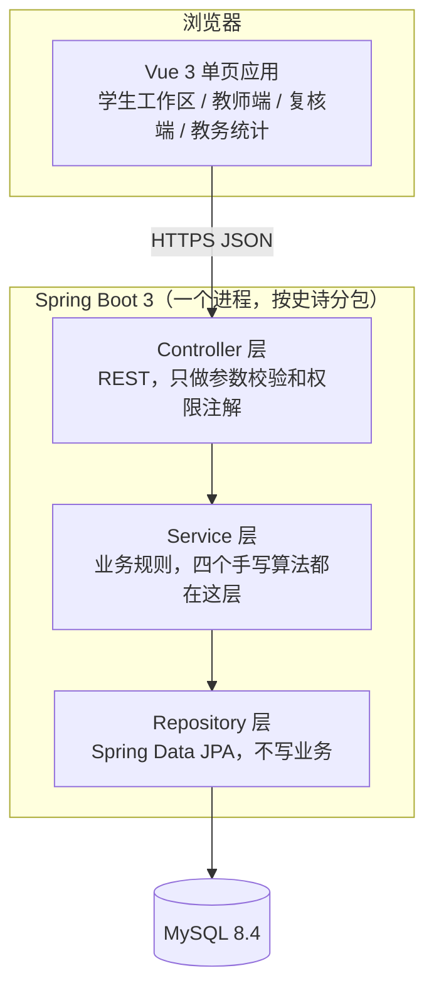

# 架构草图（手绘录入版）

> 孟甲手绘，2026-09-14 晚，A4 一页，照片 `架构草图-手绘.jpg`。录入：张家森。录入时只转成文本，没改内容。

## 分层

孟甲在旁边写的话：不做微服务，六个人一个进程够了。前后端分开部署两个容器，加一个 MySQL 容器，Docker Compose 三个服务。

## 模块（按史诗分包）

| 包           | 对应史诗     | 里面有什么                                         | 谁负责           |
| ------------ | ------------ | -------------------------------------------------- | ---------------- |
| account      | ACC          | 用户、课程、选课、名单导入、本地登录、锁定         | 杨子航           |
| policy       | RULE         | 规则版本、场景、确认阅读、**规则引擎（手写）**     | 杨子航           |
| work         | WRK          | 作业稿、自动保存、**快照与差分（手写）**、粘贴事件 | 周浩然           |
| registration | REG          | 登记、追加式修改、段落关联                         | 周浩然           |
| declaration  | DECL         | 声明生成、未使用承诺、PDF 导出                     | 张家森协助周浩然 |
| timeline     | TCH          | 时间线拼装、两版差异、文案约束                     | 周浩然           |
| attribution  | TCH-04（S2） | **段落归因与衰减（手写）**                         | 周浩然           |
| evidence     | EVD（S2）    | **哈希链（手写）**、证据包导出、校验               | 杨子航           |
| appeal       | APL（S2）    | 申诉、复核员授权                                   | 杨子航           |
| security     | PERM         | 四层权限判定、审计日志（S2）                       | 杨子航           |
| stat         | STAT（S2）   | 教务统计视图                                       | 袁飞翔           |

粗体是必须手写的算法，不许用现成库。

## 一次请求怎么走（以"学生停手 5 秒自动保存"为例）

前端 debounce 5 秒 → PUT /works/{id}/text → WorkController 校验长度不超过 50000 字符 → WorkService.save：更新当前文本、累计改动量；若距上一快照满 10 分钟或改动量超 500 字符，调 SnapshotService.create → MyersDiff 算相对上一快照的差分 → 存 delta，每 10 个存一个全文关键帧 → HashChainService 算哈希挂到上一条 → 返回"已保存 时:分:秒"。

## 不在图里但要记住的

- 所有"删除"接口一律不做，只有作废（status）。哈希链决定的。
- 时间戳全部服务端生成，DATETIME(3)，东八区。
- 文案里不能出现的词由一个常量类管，测试用脚本扫。
