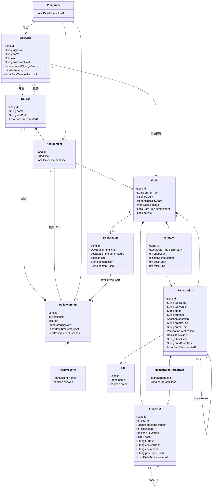
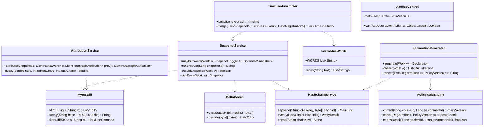

# 类图（手绘录入版）

> 周浩然手绘，2026-09-14 晚，两页，照片 `类图-手绘-第1页.jpg`（领域类）、`类图-手绘-第2页.jpg`（服务类）。录入：张家森，Mermaid classDiagram。录入时按纸上的画，没加没减；袁飞翔的检查意见写在最后。

## 第 1 页：领域类

纸上批注（周浩然）：

- 组合（实心菱形）表示"随主体存在、不可单独删"，Snapshot、PasteEvent、Registration 都挂在 Work 下面，但 Work 本身也不删，所以整棵树只增不删。
- Snapshot 指向自己是"基于哪个快照的差分"，每 10 个来一个关键帧 fullText 不为空，其余 delta 不为空。
- Registration 指向自己是"改了哪一条"，改一次生成一条新的，旧的 status 变 VOIDED。
- Sprint 2 的类（ParagraphAttribution、EvidenceExport、Appeal、AuditLog）没画，实验 8 再画，免得现在画了到时候又改。

## 第 2 页：服务类（四个手写算法在这里）

纸上批注（周浩然）：

- MyersDiff 我手写，字符级和行级都要，行级给老师端高亮用。
- DeltaCodec 独立出来是为了实验 9 换编码方式不动别的。
- HashChainService 杨子航写，chainKey 是 "work:{id}:snapshot" 或 "work:{id}:registration"，两条链分开。
- AttributionService 是 Sprint 2 的，先把签名画出来占位，decay 是"粘贴后修改"的衰减规则。
- 没画 Controller 和 Repository，模板化的东西不占纸。

## 袁飞翔对着验收标准的检查（写在图边上）

| 验收         | 图里有没有对应                              | 结论                       |
| ------------ | ------------------------------------------- | -------------------------- |
| AC-ACC-04-4  | AppUser.failedAttempts、lockedUntil         | 有                         |
| AC-RULE-01-6 | PolicyVersion.versionNo、PolicyAck 指向版本 | 有                         |
| AC-WRK-01-4  | Work.charCount                              | 有，上限在 Service 判      |
| AC-WRK-02-2  | Work.pendingEditChars                       | 有                         |
| AC-WRK-02-4  | 没有 delete 方法                            | 有，靠"没有"               |
| AC-WRK-02-5  | Snapshot.delta、keyframe                    | 有                         |
| AC-WRK-03-4  | PasteSource 里要有 PENDING                  | 图上没写枚举值，录入时补注 |
| AC-REG-01-5  | Adoption 四个值                             | 同上                       |
| AC-DECL-01-5 | Declaration 指向 PolicyVersion              | 有                         |
| AC-DECL-01-6 | Declaration.late、Work.late                 | 有                         |
| AC-TCH-03-3  | 没有任何"时长"字段                          | 有，靠"没有"               |
| AC-PERM-01-* | AccessControl.matrix                        | 有，矩阵内容在设计说明里   |

补注（张家森录入时加）：枚举值清单见 ER 图录入版末尾，两边共用。
