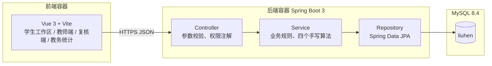
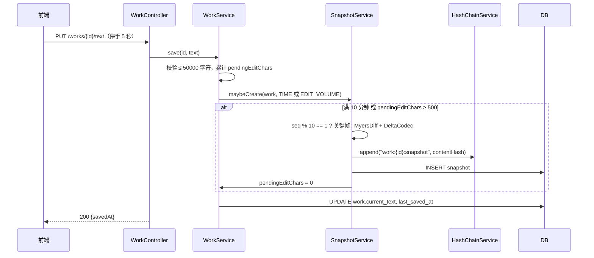

# 系统架构设计说明

> 实验 3 提交物。小组：留痕。执笔：孟甲（架构）、周浩然（类图与数据流）、杨子航（ER 图与权限矩阵）、袁飞翔（验证）、张家森（整理）。2026-09-14。
> 手绘原稿与录入版见 `01-手工原稿/`，SQL 优化过程见 `03-对比与修改记录/SQL优化对比记录.md`。本文只写结论。

## 1. 架构

单体应用，前后端分离，三个容器。六个人十周，不做微服务。

约定：

- 时间戳全部服务端生成，DATETIME(3)，东八区。
- 不存在任何"删除"接口。快照、登记、声明只增，登记的"修改"是追加新记录并把旧记录置 VOIDED。数据库触发器再挡一道。
- 不接任何外部大模型接口，作业文本不出容器网络。
- 教师端、复核端、教务端的文案由 ForbiddenWords 常量类统一管，禁用词：疑似、作弊、风险、AI 率、时长。测试用脚本扫。

## 2. 模块划分（按史诗分包）

| 包           | 史诗   | 职责                                           | Sprint | 负责人         |
| ------------ | ------ | ---------------------------------------------- | ------ | -------------- |
| account      | ACC    | 用户、课程、选课、名单导入、本地登录、失败锁定 | 1      | 杨子航         |
| policy       | RULE   | 规则版本、场景、确认阅读、规则引擎（手写）     | 1      | 杨子航         |
| work         | WRK    | 作业稿、自动保存、快照与差分（手写）、粘贴事件 | 1      | 周浩然         |
| registration | REG    | 登记、追加式修改、段落关联                     | 1      | 周浩然         |
| declaration  | DECL   | 声明生成、未使用承诺、PDF 导出                 | 1      | 周浩然、张家森 |
| timeline     | TCH    | 时间线拼装、两版差异、文案约束                 | 1      | 周浩然、丁浩然 |
| security     | PERM   | 四层权限判定；审计日志（Sprint 2）             | 1 / 2  | 杨子航         |
| attribution  | TCH-04 | 段落归因与衰减（手写）                         | 2      | 周浩然         |
| evidence     | EVD    | 哈希链（手写）、证据包导出、校验               | 2      | 杨子航         |
| appeal       | APL    | 申诉、复核员授权与回收                         | 2      | 杨子航         |
| stat         | STAT   | 教务统计视图                                   | 2      | 袁飞翔         |

## 3. 类图

领域类与服务类见 `01-手工原稿/类图-手绘录入版.md`，此处只列四个手写算法的接口，实验 5 按此实现，实验 6 按此写单测。

| 服务               | 方法                                                                                                                    | 说明                                                                          |
| ------------------ | ----------------------------------------------------------------------------------------------------------------------- | ----------------------------------------------------------------------------- |
| MyersDiff          | `diff(a, b) → List<Edit>`；`apply(base, edits) → String`；`lineDiff(a, b)`                                              | 字符级用于差分存储，行级用于教师端高亮。O((N+M)D)                             |
| DeltaCodec         | `encode(edits) → byte[]`；`decode(bytes) → List<Edit>`                                                                  | 独立出来，实验 9 换编码不动别的                                               |
| SnapshotService    | `maybeCreate(work, trigger) → Optional<Snapshot>`；`reconstruct(id) → String`                                           | 满 10 分钟或 500 字符触发；每 10 个一个关键帧；重建 = 最近关键帧 + 顺序 apply |
| HashChainService   | `append(chainKey, payload) → ChainLink`；`verify(links) → VerifyResult`                                                 | SHA-256(prev ‖ payload ‖ ts)；首条 prev 为 64 个 0；verify 返回首个断点       |
| PolicyRuleEngine   | `current(courseId, assignmentId) → PolicyVersion`；`check(reg, pv) → SceneCheck`；`needsReack(studentId, assignmentId)` | 作业级优先于课程级；按提交时版本对照；无该版本确认记录即需重弹                |
| AttributionService | `attribute(snapshot, pastes, prev) → List<ParagraphAttribution>`                                                        | Sprint 2。粘贴段初始 100%，人工修改按字符比例衰减，超 40% 变"粘贴后修改"      |

## 4. ER 图（Chen 氏）

三页手绘录入版及实体表、联系表、枚举表见 `01-手工原稿/ER图-Chen氏-手绘录入版.md`。要点：

- 15 个实体，其中弱实体 3 个：PolicyScene 依附 PolicyVersion，Snapshot 依附 Work，ParagraphAttribution 依附 Snapshot。
- 24 个联系，M:N 有 4 个：选修、确认阅读、关联段落、指派复核，各落成一张表。
- 两个自反联系：Snapshot 基于 Snapshot（差分基），Registration 替代 Registration（追加式修改）。
- 规则是"规则版本"实体，不是"规则"实体。每改一次追加一行，声明与确认都指向具体版本。

## 5. 数据库

| 脚本                         | 内容                               | 验证结果（MySQL 8.4.10）     |
| ---------------------------- | ---------------------------------- | ---------------------------- |
| 04-最终版/schema-sprint1.sql | 13 张表、6 个触发器、8 条预置工具  | 通过，utf8mb4_0900_ai_ci     |
| 04-最终版/schema-sprint2.sql | 7 张表、2 个视图、1 条设置         | 通过                         |
| 04-最终版/schema-verify.sql  | 17 条断言：10 条正向、7 条期望报错 | 全部符合期望，明细见对比记录 |

与 LLM 初稿相比的结构性差别（细节见对比记录）：

1. 快照增量存储：关键帧存全文、其余存差分，CHECK 约束保证二者必有其一。
2. 规则版本化：policy 改为 policy_version，唯一键 (course, scope_assignment, version_no)。
3. 登记追加式：去掉 updated_at，加 supersedes_id 与 status，触发器只放行 status 变更。
4. 全部外键 ON DELETE RESTRICT，不级联删除任何东西。
5. 删除了 LLM 加的 writing_minutes 字段。红线 不5：时间只记不评。
6. 哈希列 CHAR(64) ascii；计数列全部"字符"；DATETIME(3) 替代 TIMESTAMP。
7. Sprint 2 的表单独成文件，Sprint 1 不建用不到的表。

## 6. 权限矩阵（杨子航，PERM-01）

行为 = 接口，列 = 角色。✓ 允许，△ 有条件，× 403。

| 行为                   | 学生   | 教师       | 复核员                       | 教务 | 管理员 |
| ---------------------- | ------ | ---------- | ---------------------------- | ---- | ------ |
| 建课、发作业、导名单   | ×      | ✓ 本人课程 | ×                            | ×    | ✓      |
| 配置规则               | ×      | ✓ 本人课程 | ×                            | ×    | ×      |
| 用课程码加入           | ✓      | ×          | ×                            | ×    | ×      |
| 编辑作业稿、登记、提交 | ✓ 本人 | ×          | ×                            | ×    | ×      |
| 看时间线、两版差异     | ✓ 本人 | ✓ 本人课程 | △ 该稿有 OPEN 申诉且已被指派 | ×    | ×      |
| 看作业全文             | ✓ 本人 | ✓ 本人课程 | △ 同上                       | ×    | ×      |
| 导出证据包（S2）       | ✓ 本人 | ×          | △ 同上                       | ×    | ×      |
| 校验证据包（S2）       | ✓      | ✓          | ✓                            | ×    | ✓      |
| 发起申诉（S2）         | ✓ 本人 | ×          | ×                            | ×    | ×      |
| 指派复核员（S2）       | ×      | ×          | ×                            | ×    | ✓      |
| 看统计视图（S2）       | ×      | ×          | ×                            | ✓    | ✓      |
| 看审计日志（S2）       | ×      | ×          | ×                            | ×    | ✓      |

"本人课程"= course.teacher_id 等于当前用户；"本人"= work.student_id 等于当前用户。所有 × 返回 403，页面提示"没有权限"，不解释原因。

## 7. 关键流程

自动保存到快照（WRK-01、WRK-02）：

提交生成声明（DECL-01）：校验无 PENDING 粘贴 → 取 `PolicyRuleEngine.current` → 汇总 ACTIVE 登记 → 逐条 `check` 标"超出本课允许场景" → 判逾期 → 生成 content_json 与 hash → 触发 SUBMIT 快照 → work 置 SUBMITTED。

## 8. 部署

Docker Compose 三服务：frontend（nginx 静态）、backend（jar）、mysql。环境变量注入数据库口令。Sprint 2 增加统一身份认证的回调地址配置。信息中心要求的审计日志由 security 包写 audit_log 表，不走文件。

## 9. 未决事项

| 事项                             | 影响           | 谁跟进           | 何时      |
| -------------------------------- | -------------- | ---------------- | --------- |
| 统一身份认证对接方式             | ACC-03 设计    | 杨子航问信息中心 | 实验 8 前 |
| 快照间隔与粘贴阈值实测           | WRK-02、WRK-03 | 周浩然、丁浩然   | 实验 4    |
| 段落切分规则（按换行还是按句号） | REG-03、TCH-04 | 周浩然           | 实验 5    |
| 关键帧间隔 10 是否合适           | 存储与重建速度 | 周浩然实测       | 实验 9    |
